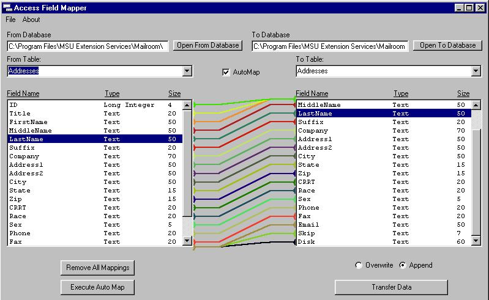



## Access Field Mapper v1\.2 \(with Type Checking\)

### Description

This is an improvement on my previous Access Field Mapper. This program allows you to open two Access databases and Map fields between two different tables (performs AutoMapping as well). After you've finished mapping the fields you can transfer the data with one click. This version will do type compatibility checking and if you transfer data that is not directly compatible it will coerce it for you.
 
### More Info
 

             |
---                |---
**Submitted On**   |2000-09-01 09:10:54
**By**             |[N/A](https://github.com/Planet-Source-Code/PSCIndex/blob/master/ByAuthor/empty.md)
**Level**          |Intermediate
**User Rating**    |4.9 (59 globes from 12 users)
**Compatibility**  |VB 6\.0
**Category**       |[Databases/ Data Access/ DAO/ ADO](https://github.com/Planet-Source-Code/PSCIndex/blob/master/ByCategory/databases-data-access-dao-ado__1-6.md)
**World**          |[Visual Basic](https://github.com/Planet-Source-Code/PSCIndex/blob/master/ByWorld/visual-basic.md)
**Archive File**   |[CODE\_UPLOAD9495912000\.zip](https://github.com/Planet-Source-Code/access-field-mapper-v1-2-with-type-checking__1-11160/archive/master.zip)

